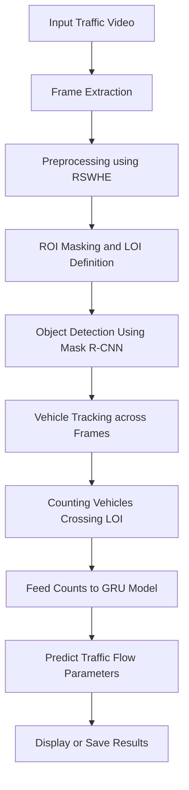
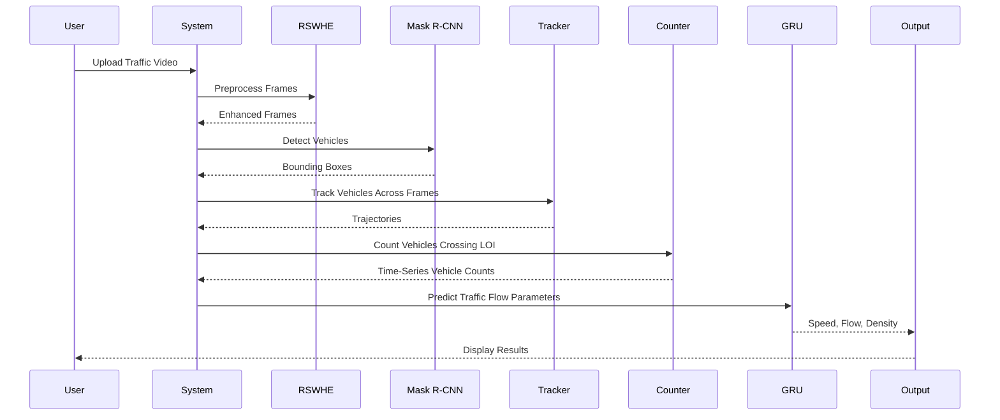
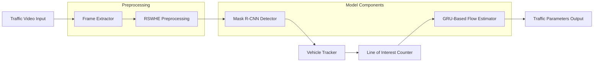

# Traffic Flow Estimation in Low-Light Conditions using RSWHE + GRU

> **Project Summary:** An intelligent traffic analysis system combining contrast-enhanced video preprocessing (RSWHE) and a GRU-based temporal model to accurately estimate traffic flow parameters under poor lighting conditions.

---

## 📽️ Problem Statement
Low-light environments (nighttime, bad weather, tunnels) pose challenges to traditional computer vision models for traffic analysis. This project proposes a hybrid solution involving:

- **RSWHE (Recursive Sub-Image Histogram Equalization)** for low-light enhancement.
- **Mask R-CNN** for vehicle detection.
- **GRU (Gated Recurrent Unit)** for temporal modeling and traffic flow estimation.

---

## 🧪 Methodology

### 🔧 Pre-processing
- Extract video frames from raw traffic footage.
- Apply **RSWHE** to enhance contrast.
- Store enhanced frames for downstream processing.

### 🚗 Vehicle Detection
- Use pre-trained **Mask R-CNN** with COCO weights to detect vehicles per frame.
- Track vehicles crossing a **line of interest (LOI)**.

### ⏱️ GRU-Based Counting
- Vehicle counts are fed into a **GRU model** to predict:
  - Vehicle Count (N)
  - Flow Rate (Q)
  - Time Mean Speed (TMS)
  - Space Mean Speed (SMS)
  - Density (K)

---

### 📊 Project Flowchart



---

### 🔄 System Sequence Diagram



---

### 🧩 Component Diagram (Architecture Overview)



---

## 📁 Project Structure
```
traffic-flow-estimation-gru-rswhe/
├── code/             # MATLAB and Python code files
│   ├── *.m           # MATLAB scripts for RSWHE & GRU pipeline
│   └── *.ipynb       # Python notebooks (Mask R-CNN detection, XML parsing)
├── models/           # Mask R-CNN pre-trained weights
├── report/           # Final report (PDF)
├── data/             # Video test samples (sample or full)
├── images/           # Output visualizations (annotated frames)
├── requirements.txt  # Python dependencies
├── .gitignore        # Git exclusion rules
└── README.md         # You’re here!
```

---

## 📜 Key Scripts

| Script | Description |
|--------|-------------|
| `counting_code.m` | Main script for running RSWHE + counting pipeline |
| `grumodel.m` | Trains GRU model on traffic count series |
| `demo_maskrcnn.ipynb` | Runs Mask R-CNN on test video frames |
| `xmlparse.ipynb` | Parses annotations or video metadata |
| `RSWHE_M/` | Contains low-light enhancement utilities |

---

## 📈 Output Metrics

| Parameter | Description |
|----------|-------------|
| N        | Vehicle Count |
| Q        | Flow Rate (vehicles/hour) |
| TMS      | Time Mean Speed |
| SMS      | Space Mean Speed |
| K        | Density (vehicles/km) |

---

## 🛠️ Tools Used

- MATLAB (2023a or above)
- Python 3.8+
- OpenCV, TensorFlow/Keras, Matplotlib
- Mask R-CNN + COCO weights (via `matterport` or custom loaders)

---

## 🚀 Getting Started

### Python Side (Detection)

```bash
# 1. Install dependencies
pip install -r requirements.txt

# 2. Run Mask R-CNN detection notebook
jupyter notebook demo_maskrcnn.ipynb
```

### MATLAB Side (Counting + GRU)

```matlab
% 1. Open MATLAB
% 2. Run main script
run('counting_code.m')
```

---

## 📄 Report

See [report/report.pdf](report/report.pdf) for methodology, evaluations, and visual outputs.

---

## 🧠 Author

**Dhanush D Shekar**  
Student @ Texas A&M University | AI + Embedded Systems Enthusiast

---
